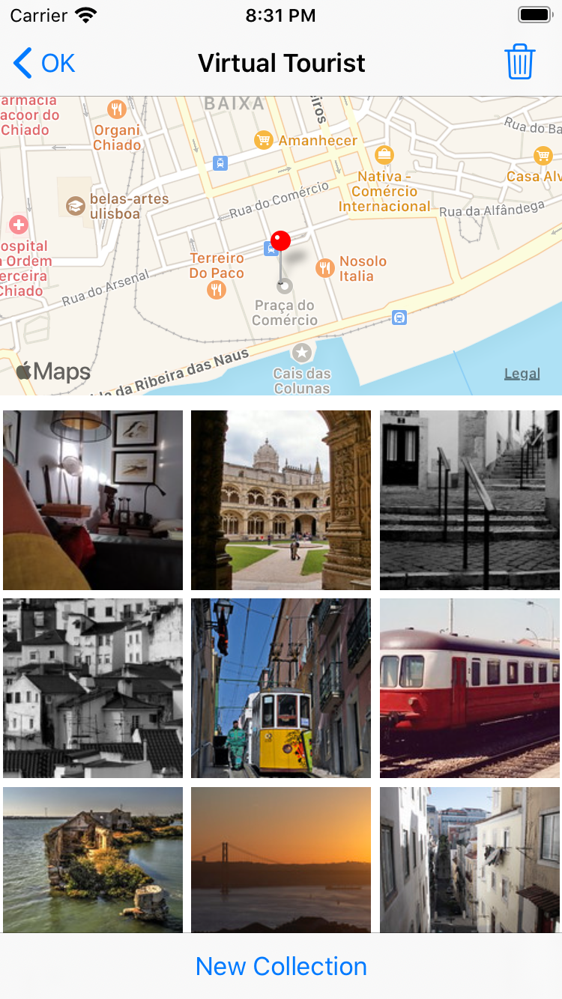

# Virtual Tourist

Fifth project of [Udacity's iOS Developer Nanodegree](https://www.udacity.com/course/ios-developer-nanodegree--nd003). 

This project consists of working with [Core Data](https://developer.apple.com/documentation/coredata) and [Flickr API](https://www.flickr.com/services/api/) where the app will allow users to add pins on the main map by long press a selected location and each pin will display downloaded public photos around the location. All data (including images) will be persisted.

**Technical Approach**

- `MapKit` was used to display maps and pins.
- `Core Data` was used to manage local persistence.
- [flickr.photos.search](https://www.flickr.com/services/api/flickr.photos.search.html) was used to get public photos by given coordinates.
- `URLSessionDataTask` was used for HTTP requests
- `JSONDecoder` and `JSONSerialization` was used for JSON parsing

**Screenshots**

<table align="center">
  <tr>
     <td>
       
       
Main screen with map

     </td>
     <td>
       
       
Added pin locations on long press

     </td>
  </tr>
  <tr>
     <td>
       
       
Album collection from selected location

     </td>
     <td>
       
       
Refreshed album collection

     </td>
  </tr>
</table>

## Installation

#### Prerequisites:

This project requires an Flickr API key.  You can follow this steps:
1. Create an app following this [link](https://www.flickr.com/services/apps/create/noncommercial/?)
2. Take note of API key
3. Edit the flow authentication of created app with these settings:
 - App type: mobile
 - Permissions: read

#### Configuration:

- Clone this repository and import into [Xcode](https://developer.apple.com/xcode/) 
- Create a new `Keys.plist` under `Assets` folder
- Create a new String key called `FlickrApiKey` inside `Keys.plist` and paste the API key
- Build it with simulator.

## Copyright

Project developed by Márcio Souza de Oliveira.
